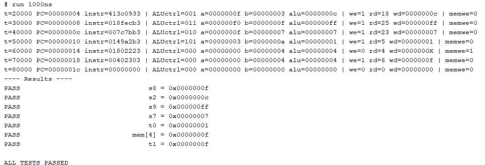
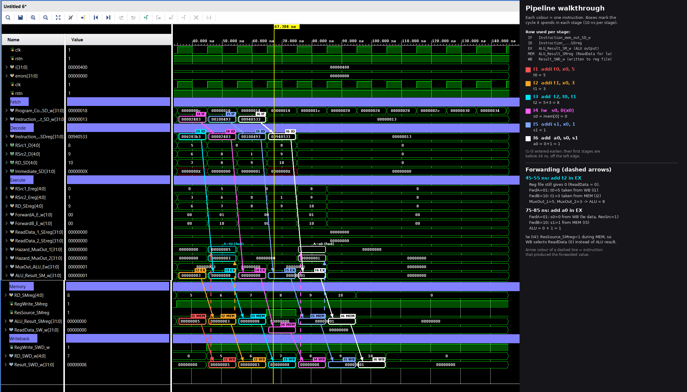
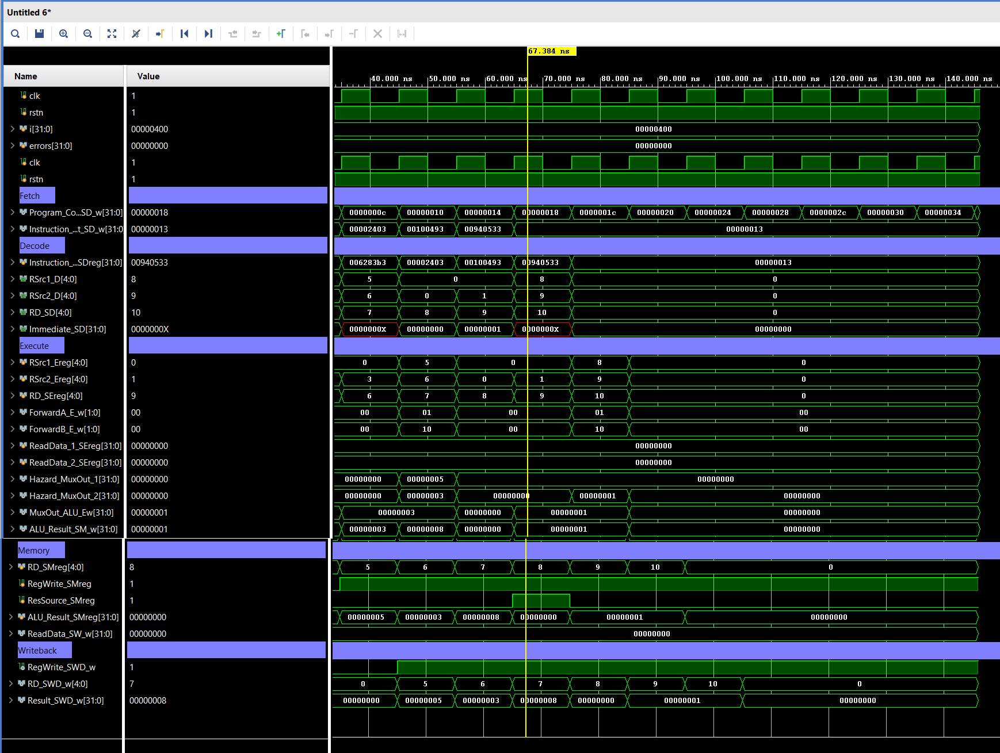

# RISCV-in-7-weekends

RV32I single-cycle and 5-stage pipelined cores in Verilog, with forwarding. A hobby project built over 7 weekends.

## What's inside

| Core | Description |
|---|---|
| **Single-cycle** | Every instruction completes in one clock. |
| **Pipelined** | Classic 5-stage pipeline (IF → ID → EX → MEM → WB) with a hazard unit that forwards results from MEM and WB back to the ALU inputs. |

Both designs follow the Harris & Harris *Digital Design and Computer Architecture (RISC-V Edition)* datapath.

## Supported instructions

| Instruction | Single-cycle | Pipelined |
|---|:---:|:---:|
| `add`, `sub`, `and`, `or`, `slt` | Yes | Yes |
| `lw` | Yes | Yes |
| `sw` | Yes | Datapath supports it, not yet tested |
| `addi` | No | Yes |

## Repo layout

```
riscv-in-7-weekends/
├── single_cycle/
│   ├── Single_core_top.v           # top level (includes the files below)
│   ├── ALU_des.v
│   ├── Control_unit.v              # main decoder + ALU decoder
│   ├── Processor_components.v      # PC, instruction/data memory, register file
│   └── tb/
│       └── SingleCycle_tb.sv       # self-checking testbench
├── pipeline/
│   ├── Core_pipe_top.v             # top level + pipeline registers
│   ├── Fetch_cycle.v
│   ├── Decode_cycle.v
│   ├── Execute_cycle.v
│   ├── Memory_cycle.v
│   ├── WriteBack_cycle.v
│   ├── Hazard_cycle.v              # forwarding logic
│   ├── ControlUnit_pipe.v
│   ├── ProcessorComponents_pipe.v  # ALU, memories, register file, muxes, extender
│   └── tb/
│       └── Pipeline_tb.sv          # self-checking testbench
├── docs/
│   ├── pipeline_waveform.png
│   ├── pipeline_waveform_annotated.png
│   └── tcl_console_single_cycle.png
└── README.md
```

## Results

### Single-cycle

Test program: `add`, `sub`, `or`, `and`, `slt`, `sw`, `lw`, one instruction per clock.



### Pipelined

Test program:

```asm
addi t0, x0, 5      # t0 = 5
addi t1, x0, 3      # t1 = 3
add  t2, t0, t1     # t2 = 8   <- t0 forwarded from WB, t1 from MEM
lw   s0, 0(x0)      # s0 = 0
addi s1, x0, 1      # s1 = 1
add  a0, s0, s1     # a0 = 1   <- s0 forwarded from WB, s1 from MEM
```

The two `add`s read registers that haven't been written back yet. The register file still returns 0, but the hazard unit forwards the correct values, so the ALU computes the right result.



*Each colour is one instruction moving through the pipeline stages. Dashed arrows show forwarding into the ALU inputs.*

<details>
<summary>Raw waveform (no annotations)</summary>



</details>

## Things I learned the hard way

- **"It elaborated" does not mean "it works."** Verilog happily accepts an undriven `alu_out`, a 1-bit bus where 5 bits belong, or a typo'd `rsnt` that silently becomes a new wire.
- **Read the port-width warnings.** One simulator padded a missing select bit with 0, another left it as `Z`. That turned a clean mux into partial-X outputs like `0000000X`.
- **Forwarding isn't the whole story.** An instruction can read a register in the same cycle it's being written back, which forwarding can't cover. The register file needs a write-through bypass.
